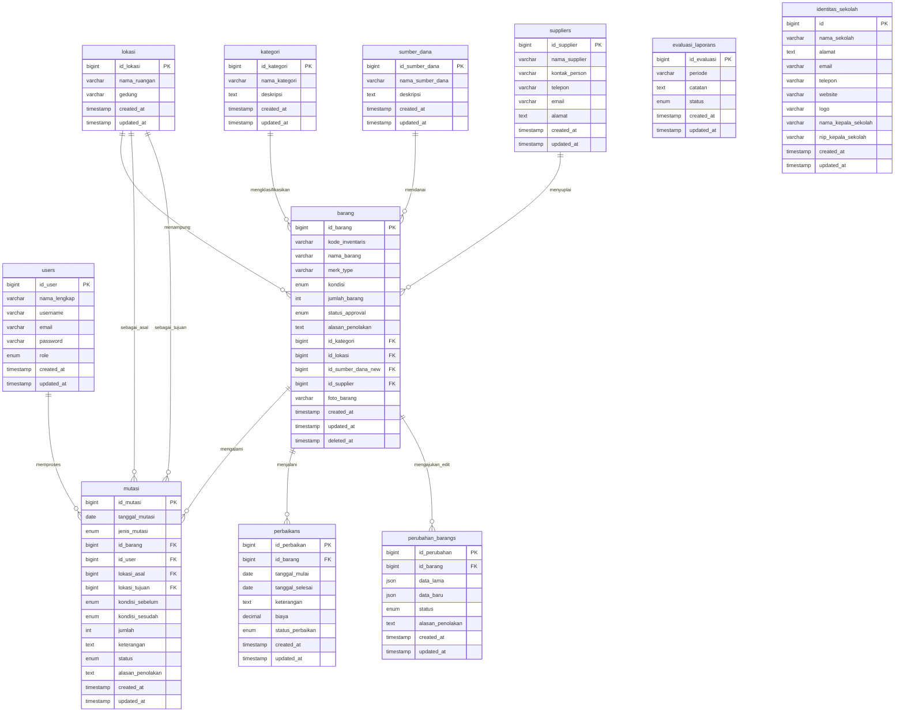

# BAB IV
# IMPLEMENTASI DAN UJICOBA

## 4.1 Implementasi
Pada tahap implementasi, seluruh rancangan konseptual yang telah disusun pada Bab III diwujudkan ke dalam kode program yang fungsional. Proses pembangunan sistem dilakukan menggunakan pendekatan arsitektur *Model-View-Controller* (MVC) yang disediakan oleh framework Laravel 11. Sisi antarmuka (*frontend*) dirancang secara responsif menggunakan mesin templat HTML *Blade* bawaan Laravel yang dipadukan dengan framework CSS TailwindCSS guna menghasilkan tata letak visual modern, dinamis, dan mudah digunakan (*user-friendly*). 

Sisi server (*backend*) mengandalkan bahasa pemrograman PHP versi 8.2 yang bertindak sebagai pemroses logika bisnis (*business logic*) dan pengatur alur kerja persetujuan (*approval workflow*). Proses sinkronisasi data memanfaatkan DBMS (Database Management System) MySQL dengan memanfaatkan fitur *Eloquent Object-Relational Mapping* (ORM) dan skema *Migration* untuk membentuk struktur tabel secara aman dan terstandarisasi. Melalui arsitektur ini, pemisahan hak akses (Role-Based Access Control) antara Admin dan Kepala Sekolah dijamin secara ketat di tingkat server, sehingga integritas data operasional inventaris sekolah tetap terjaga.

### 4.1.1 Spesifikasi Produk
Tahap implementasi sistem informasi inventaris ini membutuhkan lingkungan kerja yang memadai agar pengembangan dan operasional aplikasi bisa berjalan lancar. Spesifikasi perangkat keras dan lunak yang digunakan adalah sebagai berikut:

A. Perangkat Keras (Hardware)
1. **Lingkungan Pengembangan (Lokal)**: Laptop dengan prosesor Intel Core i5 @2.50 GHz, RAM DDR4 sebesar 8GB, dan media penyimpanan Solid State Drive (SSD) 512GB untuk mempercepat proses *indexing* dan eksekusi program lokal.
2. **Lingkungan Server (Produksi)**: Virtual Private Server (VPS) berspesifikasi minimal prosesor 2 vCPU, RAM 2GB, dan ruang penyimpanan SSD 40GB yang terhubung dengan koneksi internet berkecepatan tinggi untuk hosting aplikasi.

B. Perangkat Lunak (Software)
1. **Sistem Operasi**: Windows 11 Home 64-bit untuk pengerjaan di komputer lokal dan Linux (Ubuntu Server 22.04 LTS) untuk lingkungan server.
2. **Bahasa Pemrograman & Framework**: PHP versi 8.2 ke atas dengan framework Laravel 11 (terbaru) untuk memproses logika backend. Javascript (Vanilla/Chart.js) dan TailwindCSS untuk kebutuhan antarmuka frontend.
3. **Database & Web Server**: MySQL 8.0 sebagai pangkalan data relasional, dan Apache/Nginx sebagai web server.
4. **Library Pendukung**: Barryvdh\DomPDF untuk merender halaman HTML menjadi dokumen PDF, dan Maatwebsite\Excel untuk fungsi ekspor laporan ke format spreadsheet.
5. **Editor Kode & Tooling**: Visual Studio Code sebagai editor utama, Git untuk Version Control System, dan phpMyAdmin/DBeaver untuk memantau basis data.

---

### 4.1.2 Implementasi Database
Pada tahap ini, rancangan basis data yang telah dirancang pada Bab III diwujudkan ke dalam DBMS (Database Management System) dengan memanfaatkan MySQL. Basis data yang dibangun diberi nama `db_inventaris_barang`. Basis data ini tersusun atas 11 tabel yang saling berelasi. Untuk kebutuhan efisiensi penulisan dan kemudahan pemahaman, berikut ini disajikan visualisasi ERD serta kamus data terperinci untuk **7 tabel utama (*core tables*)** yang menjadi pilar fungsionalitas transaksi, persetujuan (*approval*), pemeliharaan, serta otentikasi hak akses pengguna.

#### 1. Skema Relasi Basis Data (ERD)
Hubungan antar-tabel dalam database `db_inventaris_barang` divisualisasikan melalui Entity Relationship Diagram (ERD) di bawah ini:



---

#### 2. Kamus Data (Data Dictionary) Tabel Utama Basis Data
Di bawah ini merupakan penjelasan terperinci mengenai struktur tabel dan kamus data yang diterapkan pada 7 tabel utama basis data `db_inventaris_barang`:

##### 1) users
Gambar 4.1 Struktur Tabel `users`

Tabel ini diimplementasikan untuk menyimpan data otentikasi login serta identitas dasar dari setiap pengguna sistem. Kolom `id_user` bertipe `bigint unsigned` diset sebagai Primary Key dengan opsi `AUTO_INCREMENT` untuk penomoran otomatis. Kolom `username` dan `email` masing-masing menggunakan tipe data `varchar(255)` dan diatur secara unik (*UNIQUE Constraint*) untuk mencegah adanya pendaftaran akun dengan kredensial yang sama. Kolom `password` bertipe `varchar(255)` menyimpan kata sandi pengguna yang telah dienkripsi dengan algoritma hashing bcrypt demi keamanan. Kolom `role` menggunakan tipe data `enum('Admin', 'Kepsek')` untuk membagi hak akses secara rigid. Kolom `created_at` dan `updated_at` bertipe `timestamp` digunakan oleh framework Laravel untuk melacak kapan akun pertama kali dibuat dan diperbarui secara otomatis.

Struktur kamus data tabel `users` disajikan pada tabel di bawah ini:

| No | Nama Field | Tipe Data | Lebar / Ukuran | Key | Nullable | Keterangan / Fungsi |
| :--- | :--- | :--- | :--- | :--- | :--- | :--- |
| 1 | id_user | bigint unsigned | 20 | PK | NO | Identitas unik pengguna (Auto Increment) |
| 2 | nama_lengkap | varchar | 255 | - | NO | Nama lengkap pengguna |
| 3 | username | varchar | 255 | UK | NO | Nama pengguna unik untuk login |
| 4 | email | varchar | 255 | UK | NO | Alamat email unik pengguna |
| 5 | password | varchar | 255 | - | NO | Kata sandi terenkripsi (bcrypt) |
| 6 | role | enum | 'Admin','Kepsek'| - | NO | Hak akses peran pengguna |
| 7 | created_at | timestamp | - | - | YES | Waktu pendaftaran akun pertama kali |
| 8 | updated_at | timestamp | - | - | YES | Waktu perubahan data akun terakhir |

##### 2) kategori
Gambar 4.2 Struktur Tabel `kategori`

Tabel ini bertindak sebagai tabel master klasifikasi yang berfungsi mengelompokkan barang-barang inventaris sekolah. Kolom `id_kategori` adalah Primary Key bertipe `bigint unsigned` auto-increment. Nama klasifikasi diinput pada kolom `nama_kategori` bertipe `varchar(255)`. Untuk menampung penjelasan deskriptif yang lebih panjang mengenai pembagian kategori tersebut, kolom `deskripsi` disediakan dengan tipe data `text` dan berstatus nullable (boleh dikosongkan). Skema waktu pembuatan dan pembaruan data dicatat pada kolom `created_at` dan `updated_at` bertipe `timestamp`.

Struktur kamus data tabel `kategori` disajikan pada tabel di bawah ini:

| No | Nama Field | Tipe Data | Lebar / Ukuran | Key | Nullable | Keterangan / Fungsi |
| :--- | :--- | :--- | :--- | :--- | :--- | :--- |
| 1 | id_kategori | bigint unsigned | 20 | PK | NO | Identitas unik kategori barang (Auto Increment) |
| 2 | nama_kategori | varchar | 255 | - | NO | Nama kategori / kelompok barang |
| 3 | deskripsi | text | - | - | YES | Catatan rincian deskripsi kategori |
| 4 | created_at | timestamp | - | - | YES | Waktu pembuatan data kategori |
| 5 | updated_at | timestamp | - | - | YES | Waktu pembaruan data kategori |

##### 3) lokasi
Gambar 4.3 Struktur Tabel `lokasi`

Tabel ini memetakan ruangan fisik dan gedung di lingkungan sekolah untuk mempermudah pelacakan sebaran barang inventaris. Primary Key tabel ini adalah `id_lokasi` bertipe `bigint unsigned` auto-increment. Kolom `nama_ruangan` (varchar(255)) mencatat nama spesifik ruangan (seperti 'Lab Multimedia', 'Perpustakaan'), sedangkan kolom `gedung` (varchar(255)) menandai lokasi blok gedung tempat ruangan tersebut berada. Kolom timestamps (`created_at`, `updated_at`) digunakan untuk pencatatan log waktu perubahan data lokasi.

Struktur kamus data tabel `lokasi` disajikan pada tabel di bawah ini:

| No | Nama Field | Tipe Data | Lebar / Ukuran | Key | Nullable | Keterangan / Fungsi |
| :--- | :--- | :--- | :--- | :--- | :--- | :--- |
| 1 | id_lokasi | bigint unsigned | 20 | PK | NO | Identitas unik ruangan (Auto Increment) |
| 2 | nama_ruangan | varchar | 255 | - | NO | Nama ruangan fisik penempatan aset |
| 3 | gedung | varchar | 255 | - | NO | Nama gedung / blok gedung ruangan berada |
| 4 | created_at | timestamp | - | - | YES | Waktu pembuatan data lokasi |
| 5 | updated_at | timestamp | - | - | YES | Waktu pembaruan data lokasi |

##### 4) barang
Gambar 4.4 Struktur Tabel `barang`

Tabel `barang` merupakan tabel transaksi inti (*core entity*) yang memuat data terperinci seluruh aset inventaris sekolah. Primary Key tabel ini adalah `id_barang` bertipe `bigint unsigned` auto-increment. Kolom `kode_inventaris` bertipe `varchar(255)` dengan indeks UNIQUE bertindak sebagai pengenal unik setiap unit aset. Kolom `nama_barang` dan `merk_type` bertipe `varchar(255)` menyimpan detail nama dan spesifikasi fisik barang, sedangkan tahun pembelian disimpan pada `tahun_perolehan` (int). Kolom `kondisi` bertipe `enum('Baik', 'Rusak Ringan', 'Rusak Berat')` menandai kondisi aktual fisik aset, dan kapasitas unit disimpan pada `jumlah_barang` bertipe `int`. 

Alur kerja persetujuan dikontrol lewat kolom `status_approval` bertipe `enum('Tersedia', 'Menunggu Penghapusan', 'Dalam Perbaikan', 'Menunggu Pengadaan', 'Pengadaan Ditolak')`. Apabila Kepala Sekolah menolak pengadaan baru, keterangannya ditampung pada `alasan_penolakan` (text). Foreign Key yang terhubung meliputi `id_kategori`, `id_lokasi`, `id_sumber_dana_new`, dan `id_supplier`. Foto dokumentasi disimpan dalam format path pada `foto_barang` (varchar(255) nullable). Fitur hapus aman didukung oleh timestamps soft deletes pada kolom `deleted_at`, yang memungkinkan pemulihan data barang yang terhapus secara tidak sengaja (*recycle bin*).

Struktur kamus data tabel `barang` disajikan pada tabel di bawah ini:

| No | Nama Field | Tipe Data | Lebar / Ukuran | Key | Nullable | Keterangan / Fungsi |
| :--- | :--- | :--- | :--- | :--- | :--- | :--- |
| 1 | id_barang | bigint unsigned | 20 | PK | NO | Identitas unik barang inventaris (Auto Increment) |
| 2 | kode_inventaris | varchar | 255 | UK | NO | Kode unik registrasi barang inventaris |
| 3 | nama_barang | varchar | 255 | - | NO | Nama barang / nama aset |
| 4 | merk_type | varchar | 255 | - | NO | Merek dan spesifikasi tipe barang |
| 5 | kondisi | enum | 'Baik','Rusak Ringan','Rusak Berat' | - | NO | Kondisi kelayakan barang saat ini |
| 6 | jumlah_barang | int | 11 | - | NO | Stok / jumlah fisik unit barang |
| 7 | status_approval | enum | 'Tersedia','Menunggu Penghapusan','Dalam Perbaikan','Menunggu Pengadaan','Pengadaan Ditolak' | - | NO | Status operasional & approval barang di sistem |
| 8 | alasan_penolakan | text | - | - | YES | Catatan penolakan persetujuan dari Kepsek |
| 9 | id_kategori | bigint unsigned | 20 | FK | NO | Relasi ke tabel `kategori` |
| 10 | id_lokasi | bigint unsigned | 20 | FK | NO | Relasi ke tabel `lokasi` |
| 11 | id_sumber_dana_new| bigint unsigned | 20 | FK | YES | Relasi ke tabel `sumber_dana` |
| 12 | id_supplier | bigint unsigned | 20 | FK | YES | Relasi ke tabel `suppliers` |
| 13 | foto_barang | varchar | 255 | - | YES | Path lokasi penyimpanan gambar barang |
| 14 | created_at | timestamp | - | - | YES | Waktu pembuatan data barang |
| 15 | updated_at | timestamp | - | - | YES | Waktu pembaruan data barang |
| 16 | deleted_at | timestamp | - | - | YES | Waktu soft delete barang (tidak tampil di index) |

##### 5) mutasi
Gambar 4.5 Struktur Tabel `mutasi`

Tabel `mutasi` merekam setiap transaksi perpindahan fisik, perubahan kondisi, maupun pengusulan pembuangan/penghapusan aset. Kolom `id_mutasi` bertipe `bigint unsigned` auto-increment bertindak sebagai Primary Key. Tanggal pelaksanaan dicatat pada `tanggal_mutasi` (date), dan jenis tindakan ditandai lewat `jenis_mutasi` dengan tipe `enum('Pindah Lokasi', 'Ubah Status', 'Penghapusan')`. Integrasi data dijamin melalui foreign key `id_barang` (merujuk ke tabel barang) dan `id_user` (merujuk ke tabel users selaku pelaksana transaksi). 

Detail pemindahan dicatat pada kolom `lokasi_asal` dan `lokasi_tujuan` (bigint unsigned nullable). Perubahan kondisi dicatat pada kolom `kondisi_sebelum` dan `kondisi_sesudah` bertipe enum. Kuantitas unit yang dimutasi dicatat pada kolom `jumlah` (int), dan keterangan pendukung disimpan pada kolom `keterangan` (text). Otorisasi transaksi dikontrol lewat kolom `status` bertipe `enum('Menunggu', 'Disetujui', 'Ditolak')` dan kolom `alasan_penolakan` (text nullable) jika ditolak oleh Kepala Sekolah.

Struktur kamus data tabel `mutasi` disajikan pada tabel di bawah ini:

| No | Nama Field | Tipe Data | Lebar / Ukuran | Key | Nullable | Keterangan / Fungsi |
| :--- | :--- | :--- | :--- | :--- | :--- | :--- |
| 1 | id_mutasi | bigint unsigned | 20 | PK | NO | Identitas unik transaksi mutasi (Auto Increment) |
| 2 | tanggal_mutasi | date | - | - | NO | Tanggal pengajuan/eksekusi mutasi |
| 3 | jenis_mutasi | enum | 'Pindah Lokasi','Ubah Status','Penghapusan' | - | NO | Kategori transaksi tindakan mutasi |
| 4 | id_barang | bigint unsigned | 20 | FK | NO | Relasi ke tabel `barang` |
| 5 | id_user | bigint unsigned | 20 | FK | NO | Relasi ke tabel `users` (Admin pengaju) |
| 6 | lokasi_asal | bigint unsigned | 20 | FK | YES | Relasi ke tabel `lokasi` (ruang asal barang) |
| 7 | lokasi_tujuan | bigint unsigned | 20 | FK | YES | Relasi ke tabel `lokasi` (ruang tujuan barang) |
| 8 | kondisi_sebelum | enum | 'Baik','Rusak Ringan','Rusak Berat' | - | YES | Kondisi fisik sebelum dimutasi |
| 9 | kondisi_sesudah | enum | 'Baik','Rusak Ringan','Rusak Berat' | - | YES | Kondisi fisik target pasca mutasi |
| 10 | jumlah | int | 11 | - | NO | Jumlah unit barang yang dimutasi |
| 11 | keterangan | text | - | - | NO | Deskripsi alasan/keterangan aksi mutasi |
| 12 | status | enum | 'Menunggu','Disetujui','Ditolak' | - | NO | Status persetujuan transaksional Kepsek |
| 13 | alasan_penolakan | text | - | - | YES | Catatan alasan penolakan mutasi dari Kepsek |
| 14 | created_at | timestamp | - | - | YES | Waktu pendaftaran transaksi mutasi |
| 15 | updated_at | timestamp | - | - | YES | Waktu pembaruan transaksi mutasi |

##### 6) perbaikans
Gambar 4.6 Struktur Tabel `perbaikans`

Tabel ini menyimpan data perawatan dan pemeliharaan untuk barang inventaris yang mengalami kerusakan. Primary Key tabel ini adalah `id_perbaikan` bertipe `bigint unsigned` auto-increment. Relasi ke tabel barang diatur melalui foreign key `id_barang` (bigint unsigned). Log waktu pemeliharaan direkam pada kolom `tanggal_mulai` (date) dan `tanggal_selesai` (date nullable), sedangkan detail deskripsi kerusakan dan penanganannya disimpan pada kolom `keterangan` (text). Biaya perbaikan dicatat pada kolom `biaya` dengan tipe `decimal(15,2)` dengan nilai bawaan 0.00 untuk menjaga presisi angka keuangan. Status pemeliharaan dipantau via kolom `status_perbaikan` bertipe `enum('Proses', 'Selesai Berhasil', 'Selesai Gagal')`.

Struktur kamus data tabel `perbaikans` disajikan pada tabel di bawah ini:

| No | Nama Field | Tipe Data | Lebar / Ukuran | Key | Nullable | Keterangan / Fungsi |
| :--- | :--- | :--- | :--- | :--- | :--- | :--- |
| 1 | id_perbaikan | bigint unsigned | 20 | PK | NO | Identitas unik transaksi perbaikan (Auto Increment) |
| 2 | id_barang | bigint unsigned | 20 | FK | NO | Relasi ke tabel `barang` |
| 3 | tanggal_mulai | date | - | - | NO | Tanggal awal barang masuk proses servis |
| 4 | tanggal_selesai | date | - | - | YES | Tanggal barang selesai diperbaiki |
| 5 | keterangan | text | - | - | NO | Deskripsi kerusakan / hasil pengerjaan servis |
| 6 | biaya | decimal | 15,2 | - | NO | Total biaya pengeluaran perbaikan (Rupiah) |
| 7 | status_perbaikan | enum | 'Proses','Selesai Berhasil','Selesai Gagal' | - | NO | Kondisi status pemeliharaan saat ini |
| 8 | created_at | timestamp | - | - | YES | Waktu pembuatan data perbaikan |
| 9 | updated_at | timestamp | - | - | YES | Waktu pembaruan data perbaikan |

##### 7) perubahan_barangs
Gambar 4.7 Struktur Tabel `perubahan_barangs`

Tabel `perubahan_barangs` diimplementasikan sebagai penampung sementara usulan pengeditan data barang oleh Admin. Primary Key tabel ini adalah `id_perubahan` bertipe `bigint unsigned` auto-increment, dengan foreign key `id_barang` bertipe `bigint unsigned`. Kolom `data_lama` bertipe `json` digunakan untuk menyimpan status data barang sebelum diedit, sedangkan kolom `data_baru` bertipe `json` menampung data usulan baru. Penggunaan tipe data JSON dipilih agar perubahan skema kolom barang tidak merusak struktur database. Status persetujuan dicatat pada kolom `status` bertipe `enum('Menunggu', 'Disetujui', 'Ditolak')` dan catatan penolakan disimpan pada `alasan_penolakan` (text nullable).

Struktur kamus data tabel `perubahan_barangs` disajikan pada tabel di bawah ini:

| No | Nama Field | Tipe Data | Lebar / Ukuran | Key | Nullable | Keterangan / Fungsi |
| :--- | :--- | :--- | :--- | :--- | :--- | :--- |
| 1 | id_perubahan | bigint unsigned | 20 | PK | NO | Identitas unik usulan edit barang (Auto Increment) |
| 2 | id_barang | bigint unsigned | 20 | FK | NO | Relasi ke tabel `barang` |
| 3 | data_lama | json | - | - | NO | Berkas JSON penyimpan data lama barang |
| 4 | data_baru | json | - | - | NO | Berkas JSON penyimpan data baru usulan Admin |
| 5 | status | enum | 'Menunggu','Disetujui','Ditolak' | - | NO | Status persetujuan Kepala Sekolah |
| 6 | alasan_penolakan | text | - | - | YES | Catatan alasan penolakan jika edit ditolak |
| 7 | created_at | timestamp | - | - | YES | Waktu pembuatan data usulan edit |
| 8 | updated_at | timestamp | - | - | YES | Waktu pembaruan data usulan edit |

---

#### 3. Hubungan dan Mekanisme Integritas Relasional
Basis data dibangun dengan mengutamakan aspek integritas data relasional. Hubungan antar tabel diatur menggunakan aturan *Foreign Key Constraints* dengan parameter *Referential Integrity* sebagai berikut:

1. **Aturan Restrict pada Master Data (`kategori` & `lokasi`)**:
   Relasi antara tabel `kategori` ke `barang` and `lokasi` ke `barang` diatur menggunakan constraint `ON DELETE RESTRICT`. Aturan ini menjamin bahwa data kategori atau ruangan tidak dapat dihapus dari database apabila masih ada barang aktif yang menggunakan kategori atau ruangan tersebut. Hal ini mencegah terjadinya *anomaly data* berupa *orphan record* (barang tanpa kategori atau lokasi penempatan yang jelas).
2. **Aturan Cascade pada Transaksi Internal (`barang` ke `mutasi`, `perbaikans`, dan `perubahan_barangs`)**:
   Relasi dari tabel `barang` ke tabel-tabel transaksi pengikutnya menggunakan constraint `ON DELETE CASCADE`. Apabila data barang dihapus secara permanen dari database, maka seluruh riwayat mutasi, perbaikan, dan pengajuan edit data yang melekat pada barang tersebut akan terhapus otomatis secara menyeluruh demi kebersihan memori basis data.
3. **Mekanisme Soft Deletes pada Barang**:
   Kolom `deleted_at` pada tabel `barang` memungkinkan penghapusan barang tidak langsung menghilangkannya secara fisik dari tabel basis data. Sistem hanya mengisi kolom `deleted_at` dengan format timestamp. Seluruh kueri Eloquent secara otomatis akan mengabaikan data ber-timestamp tersebut, menjaga data transaksi mutasi dan perbaikan historis tetap aman dari kerusakan relasi database (*break reference*).

---

### 4.1.3 Implementasi Program
Implementasi program merupakan tahap menerjemahan seluruh rancangan antarmuka (User Interface) ke dalam wujud halaman web interaktif yang terhubung langsung dengan logika sistem. Aplikasi ini dirancang menggunakan CSS modern dari TailwindCSS untuk memastikan responsivitas layar (bisa dibuka dengan nyaman pada perangkat handphone, tablet, maupun komputer desktop). Berikut merupakan penjelasan lengkap dari setiap halaman antarmuka program:

##### 1) Menu Login
Gambar 4.8 Halaman Menu Login

* **Tujuan Halaman**: Menyediakan gerbang keamanan masuk ke dalam sistem untuk membedakan antara staf Admin dan Kepala Sekolah.
* **Elemen Antarmuka**: Form isian `Username / Email` bertipe text, input `Password` bertipe password untuk menyembunyikan karakter sandi, tombol aksi "Masuk Sekarang" berwarna biru dengan efek hover dinamis, serta pesan penanda error (*alert message*) berwarna merah jika otentikasi gagal.
* **Logika & Alur Fungsional**: Ketika tombol masuk ditekan, data masukan divalidasi ke database MySQL. Sistem mencocokkan kata sandi terenkripsi dan memeriksa nilai pada kolom `role`. Admin akan dialihkan ke halaman dasbor Admin (`/admin/dashboard`), sedangkan Kepala Sekolah dialihkan ke dasbor Kepala Sekolah (`/kepsek/dashboard`).

##### 2) Menu Dashboard Admin
Gambar 4.9 Halaman Dashboard Admin

* **Tujuan Halaman**: Memberikan visualisasi cepat terkait kondisi dan jumlah aset inventaris di sekolah kepada staf Admin.
* **Elemen Antarmuka**: Panel navigasi bilah samping (*sidebar*) yang memuat menu pintasan, kartu statistik (*widget cards*) berisi angka total barang, jumlah kategori, total lokasi ruangan, dan pengajuan mutasi aktif. Terdapat pula tabel daftar pengajuan status pengadaan barang yang ditolak oleh Kepala Sekolah agar Admin bisa segera memperbaikinya.
* **Logika & Alur Fungsional**: Halaman memuat kueri agregasi database (`count()`) dari masing-masing tabel secara dinamis ketika halaman dibuka. Sidebar navigasi menggunakan tautan aktif yang memberikan perubahan warna latar belakang sesuai halaman yang sedang dibuka oleh pengguna.

##### 3) Menu Dashboard Kepala Sekolah (Kepsek)
Gambar 4.10 Halaman Dashboard Kepala Sekolah

* **Tujuan Halaman**: Mempermudah Kepala Sekolah memantau pengajuan masuk dan memberikan umpan balik (evaluasi) laporan secara cepat.
* **Elemen Antarmuka**: Kartu notifikasi antrean persetujuan (*approval alert widget*) yang menampilkan jumlah dokumen pengadaan, edit data, dan mutasi yang belum diproses. Terdapat visualisasi grafik lingkaran (doughnut chart) untuk sebaran kondisi barang (Baik, Rusak Ringan, Rusak Berat), serta widget pengisian cepat catatan evaluasi laporan periodik.
* **Logika & Alur Fungsional**: Grafik kondisi barang di-render dinamis menggunakan library Chart.js yang menerima input *array* data jumlah kondisi barang dari database. Form catatan evaluasi menggunakan validasi tipe teks sebelum data dikirimkan ke tabel `evaluasi_laporans`.

##### 4) Menu Kategori Barang
Gambar 4.11 Halaman Menu Kategori Barang

* **Tujuan Halaman**: Tempat staf Admin mendaftarkan dan memantau klasifikasi barang inventaris sekolah.
* **Elemen Antarmuka**: Tabel daftar kategori dengan kolom nomor, nama kategori, deskripsi, dan aksi. Terdapat tombol "Tambah Kategori" berwarna hijau yang membuka *modal popup*, kolom pencarian data, serta tombol Edit (kuning) dan Hapus (merah) di setiap baris tabel.
* **Logika & Alur Fungsional**: Penambahan data dilakukan via request POST secara asinkronus (AJAX) atau form submit standar dengan validasi input wajib diisi. Tombol hapus dilengkapi konfirmasi berbasis JavaScript (*SweetAlert* atau konfirmasi browser) untuk mencegah kesalahan klik.

##### 5) Menu Lokasi Ruangan
Gambar 4.12 Halaman Menu Lokasi Ruangan

* **Tujuan Halaman**: Mengelola data ruangan dan gedung tempat meletakkan barang inventaris sekolah.
* **Elemen Antarmuka**: Tabel inventarisasi ruangan yang memuat kolom nama ruangan, nama blok gedung, timestamps pembaruan data, dan tombol manipulasi CRUD. Dilengkapi kolom masukan pencarian ruangan di bagian atas tabel.
* **Logika & Alur Fungsional**: Logika hapus lokasi dilindungi oleh constraint basis data. Jika Admin menghapus lokasi yang masih memiliki barang di dalamnya, sistem menangkap *database exception* dan menampilkan pesan eror "Lokasi tidak dapat dihapus karena masih digunakan oleh barang inventaris".

##### 6) Menu Sumber Dana
Gambar 4.13 Halaman Menu Sumber Dana

* **Tujuan Halaman**: Mendaftarkan pos anggaran yang digunakan untuk mendanai setiap aset yang dimiliki sekolah.
* **Elemen Antarmuka**: Form input modal tambah sumber dana dengan inputan `Nama Sumber Dana` and `Deskripsi`. Tabel daftar sumber dana memiliki opsi pencarian dan tombol edit data pos anggaran.
* **Logika & Alur Fungsional**: Menyimpan nama sumber dana dengan validasi keunikan nama (*unique validation*) untuk menghindari duplikasi penamaan sumber anggaran yang sama di database.

##### 7) Menu Supplier
Gambar 4.14 Halaman Menu Supplier

* **Tujuan Halaman**: Menyimpan kontak informasi lengkap dari toko, distributor, atau vendor penyedia barang aset sekolah.
* **Elemen Antarmuka**: Formulir input dan tabel supplier yang mencantumkan nama perusahaan, kontak person, nomor telepon, alamat surat elektronik (email), dan alamat fisik vendor.
* **Logika & Alur Fungsional**: Validasi telepon menggunakan regex untuk memastikan format angka telepon valid, dan validasi format email wajib memiliki karakter '@' dan nama domain resmi.

##### 8) Menu Data Barang (Buku Inventaris)
Gambar 4.15 Halaman Menu Data Barang (Buku Inventaris)

* **Tujuan Halaman**: Buku inventaris sekolah utama yang menyajikan data seluruh aset aktif yang dimiliki oleh lembaga sekolah.
* **Elemen Antarmuka**: Tabel inventaris dinamis dengan filter multi-kondisi (berdasarkan lokasi ruangan, kategori barang, dan status kondisi fisik). Checklist checkbox pada sisi kiri tabel untuk memilih banyak barang secara massal, kolom pencarian teks bebas (merk, nama, atau kode), tombol "Cetak Label Terpilih", dan tombol aksi detail, edit, serta ajukan hapus.
* **Logika & Alur Fungsional**: Kueri pencarian menggunakan relasi *Eager Loading* `with()` pada Laravel untuk mencegah masalah performa *N+1 Query*. Data yang ditampilkan hanya data dengan kolom `status_approval` bernilai 'Tersedia' dan belum terhapus secara *soft delete*.

##### 9) Menu Detail Informasi Barang
Gambar 4.16 Halaman Detail Informasi Barang

* **Tujuan Halaman**: Menyajikan profil riwayat lengkap satu barang inventaris secara komprehensif untuk kebutuhan audit internal.
* **Elemen Antarmuka**: Layout grid dua kolom. Sisi kiri menampilkan foto fisik barang resolusi penuh, dan sisi kanan memuat kartu data spesifikasi teknis, asal supplier, riwayat pemindahan ruangan (mutasi), serta kartu riwayat perbaikan barang (tanggal servis, biaya, dan hasil perbaikan).
* **Logika & Alur Fungsional**: Memanggil rincian barang menggunakan relasi Eloquent (`$barang->mutasis` dan `$barang->perbaikans`). Jika foto barang bernilai null, sistem menampilkan gambar *placeholder* bawaan.

##### 10) Menu Tambah Barang (Form Pengajuan Pengadaan)
Gambar 4.17 Halaman Tambah Barang (Form Pengadaan)

* **Tujuan Halaman**: Memfasilitasi Admin mengajukan pencatatan barang baru yang baru dibeli atau diperoleh sekolah.
* **Elemen Antarmuka**: Form input teks untuk nama, merk, kode barang, tahun perolehan, dan jumlah unit. Dropdown pilihan kategori, lokasi penempatan awal, supplier, sumber dana, serta berkas unggahan foto (*file upload picker*).
* **Logika & Alur Fungsional**: File foto divalidasi bertipe jpeg/png/jpg dengan ukuran maksimal 2MB. Sistem memproses penyimpanan foto ke dalam direktori penyimpanan server (`public/barang_fotos`), mengunci status barang menjadi 'Menunggu Pengadaan', dan mengalihkan halaman ke riwayat pengadaan dengan pesan sukses.

##### 11) Menu Edit Barang (Form Pengajuan Perubahan Data)
Gambar 4.18 Halaman Edit Barang (Usulan Perubahan Data)

* **Tujuan Halaman**: Mengajukan pengeditan informasi detail barang ke Kepala Sekolah tanpa merusak data barang asli sebelum disetujui.
* **Elemen Antarmuka**: Form input yang terisi otomatis dengan nilai barang saat ini (*old values*), tombol "Simpan Usulan Perubahan", dan penanda teks informasi tata cara perubahan data.
* **Logika & Alur Fungsional**: Foto barang langsung diperbarui ke penyimpanan server untuk menghemat memori transaksi, sementara kolom teks yang diubah disimpan ke tabel `perubahan_barangs` dalam format JSON. Data asli di tabel `barang` tidak berubah sebelum disetujui Kepala Sekolah.

##### 12) Menu Pengajuan Mutasi Barang
Gambar 4.19 Halaman Menu Pengajuan Mutasi Barang

* **Tujuan Halaman**: Tempat Admin mengusulkan perpindahan ruangan, pembaruan status kelayakan barang, atau pemusnahan barang inventaris.
* **Elemen Antarmuka**: Dropdown barang aktif, input jumlah unit yang dimutasi, dropdown jenis mutasi, input dinamis (lokasi tujuan tampil jika memilih "Pindah Lokasi", dropdown kondisi akhir tampil jika memilih "Ubah Status"), dan editor teks alasan mutasi.
* **Logika & Alur Fungsional**: JavaScript dinamis dipasang untuk menyembunyikan/menampilkan kolom isian berdasarkan jenis mutasi yang dipilih oleh pengguna. Input jumlah divalidasi di sisi klien agar tidak melebihi stok barang yang tersedia.

##### 13) Menu Riwayat Mutasi Barang
Gambar 4.20 Halaman Riwayat Mutasi Barang

* **Tujuan Halaman**: Menampilkan daftar log transaksi mutasi barang untuk pelacakan alur perpindahan aset.
* **Elemen Antarmuka**: Tabel pelaporan mutasi yang mencantumkan nama barang, jenis mutasi, jumlah, lokasi asal dan tujuan, kondisi sebelum dan sesudah, nama pelaksana, status persetujuan, serta alasan penolakan jika ditolak.
* **Logika & Alur Fungsional**: Memuat data mutasi dengan status urutan tanggal mutasi terbaru (*latest*). Membedakan warna teks status persetujuan (Hijau untuk disetujui, Kuning untuk menunggu, dan Merah untuk ditolak) menggunakan logika kelas TailwindCSS bersyarat.

##### 14) Menu Persetujuan Pengadaan Barang Baru (Kepala Sekolah)
Gambar 4.21 Halaman Persetujuan Pengadaan (Kepala Sekolah)

* **Tujuan Halaman**: Memproses validasi persetujuan atas pengadaan unit barang baru dari Admin.
* **Elemen Antarmuka**: Daftar antrean pengadaan dengan tampilan kartu informasi, pratinjau foto barang, tombol "Setujui" berwarna hijau, dan tombol "Tolak" berwarna merah.
* **Logika & Alur Fungsional**: Tombol tolak akan membuka jendela modal isian alasan penolakan. Mengklik "Setujui" memicu pembaruan status barang menjadi 'Tersedia'.

##### 15) Menu Persetujuan Perubahan Data Barang (Kepala Sekolah)
Gambar 4.22 Halaman Persetujuan Perubahan Data (Kepala Sekolah)

* **Tujuan Halaman**: Menampilkan perbandingan data barang sebelum dan sesudah diedit oleh Admin untuk di-review oleh Kepala Sekolah.
* **Elemen Antarmuka**: Tata letak layar terpisah (*split screen comparison*). Sisi kiri menampilkan "Data Lama" (merah/kuning) dan sisi kanan menampilkan "Data Baru Usulan" (hijau). Dilengkapi tombol aksi persetujuan.
* **Logika & Alur Fungsional**: Membaca kolom JSON `data_lama` and `data_baru` dari tabel `perubahan_barangs` and merendernya dalam bentuk kunci-nilai (*key-value pairs*) yang human-readable.

##### 16) Menu Persetujuan Mutasi dan Penghapusan (Kepala Sekolah)
Gambar 4.23 Halaman Persetujuan Mutasi (Kepala Sekolah)

* **Tujuan Halaman**: Memproses usulan Admin terkait perpindahan ruangan aset, perbaikan status kondisi, atau pembuangan aset sekolah.
* **Elemen Antarmuka**: Tabel antrean mutasi yang menyajikan nama barang, jumlah barang, lokasi awal, lokasi tujuan usulan, alasan pemindahan, dan aksi persetujuan.
* **Logika & Alur Fungsional**: Persetujuan memicu jalannya logika *split* jika jumlah mutasi bersifat parsial di dalam sistem service database.

##### 17) Menu Cetak Label QR Code Massal
Gambar 4.24 Halaman Menu Cetak Label QR Code Massal

* **Tujuan Halaman**: Halaman konfirmasi dan pratinjau sebelum lembaran label QR Code dikonversi ke dokumen PDF untuk dicetak.
* **Elemen Antarmuka**: Grid lembaran kartu label. Setiap kartu label berisi identitas nama sekolah, nama barang, kode inventaris unik, lokasi penempatan, dan gambar QR Code dinamis.
* **Logika & Alur Fungsional**: QR Code dibuat langsung dari teks kode inventaris barang menggunakan pustaka *Simple Software IO QR Code Generator* di Laravel secara waktu nyata.

##### 18) Dokumen Hasil Cetak Label PDF
Gambar 4.25 Lembar Cetak Label PDF

* **Tujuan Halaman**: Dokumen PDF dengan format grid presisi tinggi yang siap dikirim langsung ke mesin printer untuk dicetak pada stiker label barang.
* **Elemen Antarmuka**: Dokumen PDF berukuran kertas A4 dengan pembagian grid stiker label rapi, garis batas potong, kop identitas resmi sekolah, nama aset, dan kode QR Code.
* **Logika & Alur Fungsional**: Dokumen di-render menggunakan library DomPDF dengan pengaturan CSS `@media print` untuk meniadakan margin browser saat proses pencetakan kertas stiker dilakukan.

##### 19) Halaman Laporan Inventaris
Gambar 4.26 Halaman Laporan Inventaris

* **Tujuan Halaman**: Halaman pelaporan rekapitulasi aset sekolah yang dilengkapi dengan filter pencarian lanjut untuk kebutuhan pelaporan reguler.
* **Elemen Antarmuka**: Filter dropdown ruangan, kategori, kondisi, sumber dana, tahun, dan semester. Tabel rekapitulasi jumlah aset, ringkasan statistik (jumlah barang baik, rusak ringan, rusak berat), tombol "Ekspor Excel", dan tombol "Unduh PDF".
* **Logika & Alur Fungsional**: Menjalankan query dinamis menggunakan `where` bersyarat (*conditional clause*) di Laravel berdasarkan parameter filter yang dikirimkan melalui URL parameter.

##### 20) Menu Catatan Evaluasi Laporan (Kepala Sekolah)
Gambar 4.27 Halaman Catatan Evaluasi Laporan (Kepala Sekolah)

* **Tujuan Halaman**: Memungkinkan Kepala Sekolah memberikan koreksi atau instruksi kerja tertulis kepada staf Admin setelah meninjau isi laporan inventaris.
* **Elemen Antarmuka**: Form dropdown periode semester dan tahun ajaran, area teks (*textarea*) editor catatan evaluasi, dan tombol "Kirim Catatan Evaluasi".
* **Logika & Alur Fungsional**: Data yang disimpan dikirim ke tabel `evaluasi_laporans` dengan status pembacaan awal ter-set otomatis sebagai 'Belum Dibaca'.

##### 21) Menu Tindak Lanjut Catatan Evaluasi (Admin)
Gambar 4.28 Halaman Tindak Lanjut Evaluasi (Admin)

* **Tujuan Halaman**: Memantau daftar perintah koreksi dari Kepala Sekolah dan melaporkan hasil tindak lanjut yang telah dilakukan Admin.
* **Elemen Antarmuka**: Tabel instruksi kerja, label status pembacaan (ikon lonceng merah "Belum Dibaca" atau centang hijau "Sudah Dibaca"), kolom isi instruksi pimpinan, dan tombol aksi "Tandai Sudah Dibaca".
* **Logika & Alur Fungsional**: Menekan tombol aksi mengirimkan request PATCH ke backend untuk mengubah kolom status evaluasi menjadi 'Sudah Dibaca', yang menandakan tugas perbaikan dari pimpinan telah selesai dikerjakan.

##### 22) Menu Identitas Sekolah
Gambar 4.29 Halaman Pengaturan Identitas Sekolah

* **Tujuan Halaman**: Konfigurasi profil sekolah secara dinamis agar kop surat laporan dan cetak label berubah otomatis tanpa perlu mengubah kode program.
* **Elemen Antarmuka**: Form input nama sekolah, alamat, telepon, email, website resmi, nama Kepala Sekolah, NIP Kepala Sekolah, serta form unggah logo sekolah. Tombol "Simpan Profil".
* **Logika & Alur Fungsional**: Foto logo lama yang ada di penyimpanan server akan otomatis dihapus dan digantikan logo baru ketika proses unggah berkas sukses dilakukan untuk mencegah pemborosan memori hosting server.

##### 23) Menu Manajemen Perbaikan Aset (Maintenance)
Gambar 4.30 Halaman Manajemen Perbaikan Aset (Maintenance)

* **Tujuan Halaman**: Mencatat aset yang sedang diservis ke bengkel/pihak ketiga dan mendokumentasikan hasil serta biaya perbaikan.
* **Elemen Antarmuka**: Tabel aset dalam masa perbaikan, tanggal mulai perbaikan, kolom deskripsi kerusakan. Tombol aksi "Selesai Perbaikan" yang membuka modal isian tanggal selesai, dropdown hasil ('Berhasil', 'Gagal'), dropdown kondisi akhir, dan input biaya perbaikan.
* **Logika & Alur Fungsional**: Jika perbaikan ditandai 'Berhasil', kondisi akhir barang akan memperbarui kolom kondisi di tabel `barang` secara otomatis, dan status barang dikembalikan menjadi 'Tersedia'.

---

### 4.1.4 Analisis Segmen Kode Program Utama
Bagian ini menyajikan analisis mendalam baris demi baris terhadap segmen kode program penting yang memproses transaksi database, menjamin keamanan hak akses, dan mengatur alur kerja persetujuan inventaris:

#### Segmen Program 4.1 Logika Otentikasi Login (`AuthController.php`)
Kode program ini menangani proses autentikasi keamanan pengguna ke dalam aplikasi:

```php
public function login(Request $request)
{
    // 1. Validasi input kredensial pengguna
    $data = $request->validate([
        'login' => ['required', 'string'],
        'password' => ['required'],
    ]);

    // 2. Memanggil AuthService untuk mencocokkan kredensial ke database
    if ($this->authService->login($data)) {
        // 3. Jika otentikasi berhasil, periksa wewenang role pengguna
        if (auth()->user()->role === 'Admin') {
            return redirect()->intended('/admin/dashboard');
        } else {
            return redirect()->intended('/kepsek/dashboard');
        }
    }

    // 4. Jika gagal, kembalikan dengan membawa pesan error
    return back()->withErrors([
        'login' => 'Username atau password salah.',
    ])->onlyInput('login');
}
```

##### Penjelasan Logika Program:
1. **Baris 3-6**: Metode `$request->validate()` digunakan untuk mengamankan inputan dari serangan injeksi dan memastikan kolom `login` (berisi username/email) serta `password` wajib diisi sebelum program diproses lebih lanjut.
2. **Baris 9**: Logika pencocokan diserahkan ke `AuthService`. Di tingkat service, password dicocokkan dengan password terenkripsi di database menggunakan metode pencocokan hash `Hash::check()`.
3. **Baris 11-15**: Fungsi `auth()->user()->role` membaca kolom peran pada tabel `users`. Laravel memindahkan sesi pengguna ke dasbor yang sesuai menggunakan `redirect()->intended()` agar pengguna kembali ke halaman terakhir yang ingin diaksesnya sebelum dialihkan ke form login.
4. **Baris 19-21**: Jika kredensial tidak cocok, pengguna diarahkan kembali ke halaman login membawa pesan error dan mengembalikan inputan username terakhir (`onlyInput('login')`) agar pengguna tidak perlu mengetik ulang.

---

#### Segmen Program 4.2 Middleware Hak Akses (`CheckRole.php`)
Middleware ini bertindak sebagai penjaga gerbang lalu lintas URL aplikasi:

```php
namespace App\Http\Middleware;

use Closure;
use Illuminate\Http\Request;
use Symfony\Component\HttpFoundation\Response;
use Illuminate\Support\Facades\Auth;

class CheckRole
{
    public function handle(Request $request, Closure $next, ...$roles): Response
    {
        // 1. Memeriksa status login dan kecocokan daftar role
        if (!Auth::check() || !in_array(Auth::user()->role, $roles)) {
            abort(403, 'Akses ditolak. Anda tidak memiliki izin untuk halaman ini.');
        }

        // 2. Meneruskan permintaan jika kondisi terpenuhi
        return $next($request);
    }
}
```

##### Penjelasan Logika Program:
1. **Baris 11**: `...$roles` adalah parameter dinamis (*splat operator*) yang menampung daftar peran yang diizinkan untuk rute tertentu (misal: 'Admin', 'Kepsek').
2. **Baris 13**: Fungsi `Auth::check()` memastikan sesi login pengguna masih aktif di server. Fungsi `in_array()` mencari apakah peran pengguna saat ini (`Auth::user()->role`) terdaftar dalam daftar parameter `$roles`.
3. **Baris 14**: Jika salah satu kondisi tidak terpenuhi (belum login atau peran tidak cocok), eksekusi program dihentikan seketika dan server melempar kode respon HTTP 403 Forbidden via fungsi `abort()`.
4. **Baris 18**: Jika valid, fungsi `$next($request)` memanggil middleware berikutnya atau mengizinkan pengontrol rute merender tampilan halaman yang dituju.

---

#### Segmen Program 4.3 Registrasi Pengadaan Barang Baru (`BarangController.php`)
Kode program ini memproses inputan pengadaan barang baru dari Admin:

```php
public function store(Request $request)
{
    // 1. Melakukan validasi tipe data input
    $data = $request->validate([
        'kode_inventaris' => 'required|string|unique:barang,kode_inventaris',
        'nama_barang' => 'required|string|max:255',
        'merk_type' => 'required|string|max:255',
        'tahun_perolehan' => 'required|integer|digits:4',
        'kondisi' => 'required|in:Baik,Rusak Ringan,Rusak Berat',
        'id_kategori' => 'required|exists:kategori,id_kategori',
        'id_lokasi' => 'required|exists:lokasi,id_lokasi',
        'id_supplier' => 'required|exists:suppliers,id_supplier',
        'jumlah_barang' => 'required|integer|min:1',
        'foto_barang' => 'nullable|image|mimes:jpeg,png,jpg|max:2048',
        'id_sumber_dana_new' => 'required|exists:sumber_dana,id_sumber_dana',
    ]);

    // 2. Pemetaan nama sumber dana dinamis
    $sd = $this->sumberDanaService->getById($request->id_sumber_dana_new);
    $data['sumber_dana'] = $sd->nama_sumber_dana;

    // 3. Menyimpan ke database via BarangService
    $this->barangService->create($data);
    
    // 4. Dialihkan ke halaman pengajuan
    return redirect()->route('admin.pengajuan.index')
        ->with('success', 'Barang berhasil diajukan dan sedang menunggu persetujuan Kepala Sekolah.');
}
```

##### Penjelasan Logika Program:
1. **Baris 4-15**: Validasi memastikan integritas referensi basis data (`exists` constraint) agar ID kategori, lokasi, supplier, dan sumber dana benar-benar ada di tabel masternya masing-masing. Validasi `unique:barang,kode_inventaris` mencegah duplikasi label inventaris di sekolah.
2. **Baris 18-19**: Sistem menarik data objek sumber dana berdasarkan ID, lalu memasukkan nama sumber dana ke dalam array data untuk kompatibilitas skema database warisan (*legacy field mapping*).
3. **Baris 22**: Memanggil metode `create()` pada `BarangService`. Di dalam service, jika file foto diunggah, sistem menyimpannya ke penyimpanan lokal server dan mengisi kolom status barang secara otomatis menjadi 'Menunggu Pengadaan' agar tidak langsung muncul di buku inventaris utama sekolah.

---

#### Segmen Program 4.4 Pengajuan Usulan Edit Data Barang (`BarangService.php`)
Kode program ini memproses penyuntingan barang menggunakan skema buffer (penampung sementara):

```php
public function update($id, array $data)
{
    $barang = Barang::findOrFail($id);

    // 1. Memproses penggantian foto barang secara langsung
    if (isset($data['foto_barang'])) {
        if ($barang->foto_barang && Storage::disk('public')->exists($barang->foto_barang)) {
            Storage::disk('public')->delete($barang->foto_barang);
        }
        $barang->foto_barang = $data['foto_barang']->store('barang_fotos', 'public');
        $barang->save();
        unset($data['foto_barang']);
    }

    if (empty($data)) return $barang;

    // 2. Mengambil snapshot data lama barang
    $dataLama = $barang->only(array_keys($data));

    // 3. Menyimpan riwayat usulan perubahan ke tabel buffer
    PerubahanBarang::create([
        'id_barang'  => $barang->id_barang,
        'data_lama'  => $dataLama,
        'data_baru'  => $data,
        'status'     => 'Menunggu',
    ]);

    return $barang;
}
```

##### Penjelasan Logika Program:
1. **Baris 6-12**: Jika file gambar baru dikirimkan, sistem mendeteksi keberadaan gambar lama di direktori penyimpanan server menggunakan `Storage::disk('public')->exists()`, menghapusnya untuk menghemat memori server, mengunggah foto baru, dan langsung memperbaruinya ke tabel barang tanpa memerlukan validasi Kepala Sekolah.
2. **Baris 17**: Fungsi `only(array_keys($data))` digunakan untuk menyaring dan mengambil data kolom pada tabel barang asli yang nilainya diusulkan diubah oleh Admin saja.
3. **Baris 20-25**: Data lama dan data baru usulan disimpan ke dalam kolom JSON pada tabel `perubahan_barangs` dengan status default 'Menunggu'. Hal ini memproteksi data asli barang di tabel `barang` agar tidak termodifikasi sebelum disetujui Kepala Sekolah.

---

#### Segmen Program 4.5 Pengajuan Transaksi Mutasi Barang (`MutasiService.php`)
Kode program ini mengelola transaksi awal mutasi barang (pindah lokasi, ubah kondisi, atau penghapusan):

```php
public function create(array $data)
{
    return DB::transaction(function () use ($data) {
        $barang = Barang::findOrFail($data['id_barang']);

        // 1. Validasi jumlah barang yang dimutasi terhadap stok riil
        if ($data['jumlah'] > $barang->jumlah_barang) {
            throw new \Exception('Jumlah mutasi melebihi sisa barang yang tersedia.');
        }

        // 2. Pemetaan data mutasi sebelum dieksekusi
        $data['id_user'] = Auth::user()->id_user;
        $data['lokasi_asal'] = $barang->id_lokasi;
        $data['kondisi_sebelum'] = $barang->kondisi;
        $data['status'] = 'Menunggu'; 

        // 3. Membuat baris data transaksi mutasi
        return Mutasi::create($data);
    });
}
```

##### Penjelasan Logika Program:
1. **Baris 3**: Fungsi penutupan `DB::transaction()` digunakan untuk memastikan apabila terjadi kegagalan sistem di tengah proses penyimpanan data, seluruh transaksi dibatalkan kembali (*rollback*) untuk mencegah inkonsistensi data.
2. **Baris 6-8**: Melakukan validasi kuantitas. Jika jumlah unit barang yang diajukan mutasi lebih besar dibandingkan kapasitas barang riil di sekolah (`jumlah_barang`), sistem melempar pengecualian (*exception*) untuk membatalkan transaksi.
3. **Baris 11-14**: Sistem mengisi data secara otomatis: `id_user` diambil dari ID Admin yang sedang login, `lokasi_asal` disamakan dengan lokasi barang saat ini di database, `kondisi_sebelum` diambil dari kondisi barang riil saat ini, dan status diatur sebagai pending 'Menunggu'.

---

#### Segmen Program 4.6 Otorisasi Persetujuan Pengadaan Barang Baru (`ApprovalController.php`)
Segmen program ini mengelola aksi persetujuan atas pengadaan unit barang baru oleh Kepala Sekolah:

```php
public function approvePengadaan($id)
{
    // 1. Menyetujui pengadaan barang
    $this->barangService->approvePengadaan($id);
    return redirect()->route('kepsek.approval.pengadaan')
        ->with('success', 'Pengajuan pengadaan berhasil disetujui. Barang telah dimasukkan ke dalam sistem.');
}

public function rejectPengadaan(Request $request, $id)
{
    // 2. Validasi alasan penolakan dan eksekusi penolakan
    $request->validate(['alasan_penolakan' => 'required|string|max:500']);
    $this->barangService->rejectPengadaan($id, $request->alasan_penolakan);
    return redirect()->route('kepsek.approval.pengadaan')
        ->with('success', 'Pengajuan pengadaan telah ditolak.');
}
```

##### Penjelasan Logika Program:
1. **Baris 4**: Memanggil `approvePengadaan` pada `BarangService` yang memperbarui status kolom `status_approval` pada tabel barang dari 'Menunggu Pengadaan' menjadi 'Tersedia' sehingga barang tersebut resmi terdaftar dan muncul di buku inventaris sekolah.
2. **Baris 11**: Sebelum penolakan diproses, form input wajib mengisi alasan penolakan (`alasan_penolakan`) dengan batas maksimal 500 karakter.
3. **Baris 12**: Memanggil `rejectPengadaan` pada `BarangService` yang mengubah kolom `status_approval` menjadi 'Pengadaan Ditolak' dan mengisi kolom `alasan_penolakan` di tabel barang agar Admin dapat merevisi data barang tersebut.

---

#### Segmen Program 4.7 Otorisasi Persetujuan Perubahan Data Barang (`ApprovalController.php`)
Kode program ini memproses persetujuan usulan penyuntingan data barang:

```php
public function approvePerubahan($id)
{
    // 1. Eksekusi persetujuan dan pembaruan data asli barang
    $this->barangService->approvePerubahan($id);
    return redirect()->route('kepsek.approval.perubahan')
        ->with('success', 'Perubahan data barang telah disetujui and diterapkan.');
}

public function rejectPerubahan(Request $request, $id)
{
    // 2. Eksekusi penolakan perubahan data barang
    $request->validate(['alasan_penolakan' => 'required|string|max:500']);
    $this->barangService->rejectPerubahan($id, $request->alasan_penolakan);
    return redirect()->route('kepsek.approval.perubahan')
        ->with('success', 'Perubahan data barang telah ditolak.');
}
```

##### Penjelasan Logika Program:
1. **Baris 4**: Metode `approvePerubahan` pada `BarangService` membaca tabel `perubahan_barangs`. Sistem mengambil data JSON baru pada kolom `data_baru`, melakukan kueri pembaruan (*update*) ke baris data barang asli di tabel `barang`, dan merubah kolom status pengusulan menjadi 'Disetujui'.
2. **Baris 11-13**: Jika Kepala Sekolah menolak, sistem mengubah status pengusulan menjadi 'Ditolak' dan menyimpan catatan penolakannya ke kolom `alasan_penolakan` pada tabel `perubahan_barangs` tanpa mengubah data barang asli sedikit pun.

---

#### Segmen Program 4.8 Mekanisme Persetujuan Mutasi dan Split Aset (`MutasiService.php`)
Kode program ini memproses persetujuan mutasi, pemindahan lokasi, perubahan kondisi fisik, atau penghapusan barang:

```php
public function approveMutasi($id)
{
    return DB::transaction(function () use ($id) {
        $mutasi = Mutasi::findOrFail($id);
        $barang = Barang::findOrFail($mutasi->id_barang);

        // 1. Verifikasi ketersediaan jumlah stok barang
        if ($mutasi->jumlah > $barang->jumlah_barang) {
            throw new \Exception('Jumlah mutasi melebihi sisa barang yang tersedia.');
        }

        // 2. Mekanisme Split Aset untuk mutasi sebagian
        if ($mutasi->jumlah < $barang->jumlah_barang) {
            $barang->decrement('jumlah_barang', $mutasi->jumlah);

            $targetBarang = $barang->replicate();
            $targetBarang->jumlah_barang = $mutasi->jumlah;
            $targetBarang->kode_inventaris = $barang->kode_inventaris . '-SPLIT-' . time();
            $targetBarang->save();
        } else {
            $targetBarang = $barang;
        }

        // 3. Mengarahkan relasi mutasi ke barang hasil split
        $mutasi->id_barang = $targetBarang->id_barang;

        // 4. Mengeksekusi perpindahan fisik aset sesuai jenis mutasi
        if ($mutasi->jenis_mutasi === 'Pindah Lokasi') {
            $targetBarang->update(['id_lokasi' => $mutasi->lokasi_tujuan]);
        } elseif ($mutasi->jenis_mutasi === 'Ubah Status') {
            $targetBarang->update(['kondisi' => $mutasi->kondisi_sesudah]);
        } elseif ($mutasi->jenis_mutasi === 'Penghapusan') {
            $targetBarang->delete(); 
        }

        // 5. Menyelesaikan transaksi mutasi
        $mutasi->status = 'Disetujui';
        $mutasi->save();

        return $mutasi;
    });
}
```

##### Penjelasan Logika Program:
1. **Baris 11-19**: **Logika Split Aset**. Jika jumlah barang yang dimutasi lebih kecil dari persediaan barang riil (mutasi parsial), sistem mengurangi stok barang lama menggunakan `decrement()`. Lalu, sistem menduplikasi objek barang lama tersebut menggunakan `replicate()`, mengisi kolom kuantitas dengan jumlah unit yang dimutasi, memberikan kode inventaris baru berakhiran timestamp agar unik, dan menyimpannya sebagai baris data barang baru di database. Jika mutasi bersifat total, objek target langsung diarahkan ke barang asli.
2. **Baris 25-31**: Sistem memeriksa jenis mutasi yang disetujui. Jika "Pindah Lokasi", kolom `id_lokasi` pada barang target diperbarui ke ID lokasi baru. Jika "Ubah Status", kolom `kondisi` diperbarui. Jika "Penghapusan", sistem melakukan eksekusi soft delete (`delete()`) pada barang target tersebut.
3. **Baris 34-35**: Status pengajuan mutasi diubah menjadi 'Disetujui' dan disimpan ke tabel `mutasi`.

---

#### Segmen Program 4.9 Cetak Label Barcode Massal (`LaporanController.php`)
Kode program ini memproses pencetakan stiker label secara berkelompok:

```php
public function printLabelBatch(Request $request)
{
    // 1. Menangkap array ID barang yang dipilih
    $ids = $request->input('ids', []);
    if (empty($ids)) {
        return back()->with('error', 'Pilih minimal 1 barang untuk dicetak labelnya.');
    }
    
    // 2. Query mengambil data barang beserta relasi tabel master
    $barangs = Barang::with(['kategori', 'lokasi'])->whereIn('id_barang', $ids)->get();
    
    // 3. Mengambil profil kop sekolah
    $identitas = \App\Models\IdentitasSekolah::first();
    
    // 4. Merender tampilan cetak label
    return view('laporan.label_batch', compact('barangs', 'identitas'));
}
```

##### Penjelasan Logika Program:
1. **Baris 4-7**: Sistem menangkap masukan berupa array data ID barang (`ids`) yang dikirim dari form centang (*checkbox*) di buku inventaris. Jika array kosong, sistem membatalkan proses dan mengembalikan pengguna dengan pesan error.
2. **Baris 10**: Fungsi `whereIn('id_barang', $ids)` mengambil seluruh barang yang ID-nya terdaftar di dalam array masukan. Penggunaan `with(['kategori', 'lokasi'])` melampirkan data nama kategori dan nama ruangan penempatan barang secara langsung untuk kebutuhan informasi stiker label.
3. **Baris 13**: Menarik data konfigurasi profil lembaga sekolah dari tabel `identitas_sekolah` untuk ditampilkan sebagai kop stiker label.
4. **Baris 16**: Seluruh data dilempar ke halaman Blade `laporan.label_batch` yang berisi kode merender gambar QR Code untuk masing-masing barang.

---

#### Segmen Program 4.10 Pengiriman Catatan Evaluasi Laporan (`EvaluasiController.php`)
Kode program ini memproses pengiriman masukan pengawasan dari Kepala Sekolah:

```php
public function store(Request $request)
{
    // 1. Validasi input form evaluasi
    $request->validate([
        'tahun_evaluasi' => 'required|string|max:255',
        'semester_evaluasi' => 'required|string|max:255',
        'catatan' => 'required|string',
    ]);

    // 2. Menggabungkan semester dan tahun menjadi satu string periode
    $periode = $request->semester_evaluasi . ' ' . $request->tahun_evaluasi;

    // 3. Menyimpan ke database via EvaluasiService
    $this->evaluasiService->create([
        'periode' => $periode,
        'catatan' => $request->catatan,
    ]);

    return back()->with('success', 'Evaluasi laporan berhasil dikirim ke Admin.');
}
```

##### Penjelasan Logika Program:
1. **Baris 4-8**: Validasi memastikan tahun evaluasi, nama semester, dan isi teks instruksi wajib diisi oleh Kepala Sekolah.
2. **Baris 11**: Sistem merangkai teks variabel `$request->semester_evaluasi` and `$request->tahun_evaluasi` (misalnya: "Ganjil" dan "2026") menjadi satu string berformat "Ganjil 2026" untuk disimpan di kolom `periode`.
3. **Baris 14-17**: Memanggil `create()` pada `EvaluasiService` yang memicu kueri insert data baru ke tabel `evaluasi_laporans` dengan nilai status default 'Belum Dibaca' agar muncul sebagai notifikasi penugasan baru di dasbor Admin.

---

#### Segmen Program 4.11 Ekspor Laporan Inventaris ke PDF (`LaporanController.php`)
Segmen program ini digunakan untuk mengekstrak data dari database MySQL dan merendernya ke dokumen PDF. Fungsi `exportPdf` menangkap seluruh kriteria filter laporan yang diinput pengguna (lokasi, kondisi, kategori, sumber dana, tahun, dan semester), menarik data barang yang sesuai menggunakan `LaporanService`, dan merender visualisasi tabel laporan menggunakan templat PDF berorientasi mendatar (Landscape) dengan kertas ukuran A4 melalui pustaka Barryvdh\DomPDF sebelum diunduh oleh browser pengguna.

```php
public function exportPdf(Request $request)
{
    // 1. Menangkap parameter filter pencarian dari URL
    $filter = $request->only(['id_lokasi', 'kondisi', 'id_kategori', 'id_sumber_dana', 'tahun', 'semester']);
    
    // 2. Query filter dinamis data barang via LaporanService
    $laporanService = new \App\Services\LaporanService();
    $query = $laporanService->getBarangLaporan($filter);
    $barang = $query->get();

    // 3. Menghitung ringkasan statistik barang terfilter
    $stats = $laporanService->getStats($barang);

    // 4. Merender file PDF landscape ukuran A4
    $pdf = Pdf::loadView('laporan.pdf', compact('barang', 'stats', 'filter'))->setPaper('a4', 'landscape');
    
    // 5. Mengirimkan file unduhan PDF ke browser pengguna
    return $pdf->download('Laporan_Inventaris_'.date('Ymd').'.pdf');
}
```

##### Penjelasan Logika Program:
1. **Baris 4**: Metode `$request->only()` menyaring parameter filter yang dikirim dari form filter laporan agar parameter kotor lainnya tidak merusak kueri basis data.
2. **Baris 7-9**: Menyerahkan penyusunan kueri dinamis ke `LaporanService`. Kueri menyusun perintah *conditional search* (misal: jika kategori diisi, sistem menyusun kueri `where('id_kategori', $id)`).
3. **Baris 15**: Metode `Pdf::loadView()` memanggil pustaka DomPDF untuk memproses rendering file tampilan HTML `laporan.pdf` menjadi layout PDF. Fungsi `setPaper('a4', 'landscape')` mengatur orientasi kertas mendatar agar data tabel yang lebar tidak terpotong.
4. **Baris 18**: Mengunduh berkas laporan dengan format penamaan nama dinamis berupa tanggal cetak saat ini (format 'Ymd' / TahunBulanTanggal).

---

#### Segmen Program 4.12 Modul Pencatatan Perbaikan Aset (`PerbaikanController.php`)
Kode program ini memproses siklus hidup pemeliharaan aset rusak:

```php
public function store(Request $request)
{
    // 1. Validasi input pengajuan servis
    $data = $request->validate([
        'id_barang' => 'required|exists:barang,id_barang',
        'tanggal_mulai' => 'required|date',
        'keterangan' => 'required|string',
    ]);

    // 2. Eksekusi penguncian status barang ke mode pemeliharaan
    $this->perbaikanService->mulaiPerbaikan($data['id_barang'], $data);

    return redirect()->route('perbaikan.index')
        ->with('success', 'Perbaikan berhasil diajukan dan sedang diproses.');
}

public function selesai(Request $request, $id)
{
    // 3. Validasi input penyelesaian servis
    $data = $request->validate([
        'tanggal_selesai' => 'required|date',
        'hasil' => 'required|in:Berhasil,Gagal',
        'kondisi_akhir' => 'nullable|required_if:hasil,Berhasil|in:Baik,Rusak Ringan',
        'biaya' => 'nullable|numeric|min:0',
    ]);

    // 4. Eksekusi update kondisi akhir barang dan biaya servis
    $this->perbaikanService->selesaiPerbaikan($id, $data);

    return redirect()->route('perbaikan.index')
        ->with('success', 'Status perbaikan berhasil diperbarui.');
}
```

##### Penjelasan Logika Program:
1. **Baris 10**: Metode `mulaiPerbaikan` di service memproses penambahan baris data baru ke tabel `perbaikans` dengan status perbaikan awal 'Proses'. Sistem juga memperbarui kolom `status_approval` pada tabel `barang` menjadi 'Dalam Perbaikan' agar barang tidak dapat diajukan mutasi atau dihapus selama masa pemeliharaan berlangsung.
2. **Baris 19-24**: Validasi input penyelesaian perbaikan. Kolom `kondisi_akhir` (kondisi fisik barang pasca-servis) wajib diisi hanya apabila hasil perbaikan bertanda 'Berhasil' (`required_if:hasil,Berhasil`). Biaya wajib berupa angka nominal positif.
3. **Baris 27**: Metode `selesaiPerbaikan` memperbarui baris perbaikan dengan tanggal selesai, biaya, dan hasil perbaikan. Jika hasil 'Berhasil', sistem memperbarui kolom `kondisi` pada tabel `barang` dengan data `kondisi_akhir`, lalu mengembalikan kolom `status_approval` menjadi 'Tersedia'.

---

## 4.2 Uji Coba
Bagian ini menjelaskan tentang uji coba yang dilakukan terhadap sistem informasi inventaris. Pengujian perangkat lunak (software testing) dilakukan secara menyeluruh terhadap lingkungan sistem fungsional menggunakan metode Black Box.

### 4.2.1 Tahap Pengujian
Pengujian Black Box Testing berfokus pada spesifikasi fungsional antarmuka, di mana input yang dikirimkan ke server diharapkan mengembalikan output atau perubahan status tabel MySQL yang sesuai dengan rancangan sistem, tanpa melihat rincian internal kodenya. Rincian tahapan pengujian mencakup:

A. Target Pengujian: Fungsionalitas otentikasi login, operasi data CRUD, mekanisme pemisahan hak akses, workflow pengajuan-persetujuan (mutasi/pengadaan), pencetakan QR code, dan generate laporan berformat file.
B. Instrumen Pengujian: Laptop penguji dengan peramban (browser Chrome/Edge) yang terhubung ke jaringan lokal pengembangan.
C. Skenario Pengujian: Pengkondisian dua pengguna paralel (sesi Admin dan sesi Kepala Sekolah secara bersamaan pada peramban berbeda/mode penyamaran).
D. Urutan Langkah Pengujian (Contoh Skenario "Persetujuan Barang"): 
1. Penguji masuk (login) sebagai Admin, lalu mengisi formulir input "Mutasi Barang".
2. Penguji memeriksa apakah barang telah berpindah lokasi pada halaman utama barang (Hasil Diharapkan: Belum berpindah, karena status mutasi masih "Menunggu"). 
3. Penguji kemudian masuk sebagai Kepala Sekolah, membuka modul "Persetujuan Mutasi", dan menekan tombol "Setujui" (Approve). 
4. Penguji kembali mengecek tabel barang untuk melihat apakah lokasi barang tersebut sudah berubah di basis data sistem secara otomatis.

---

### 4.2.2 Hasil Pengujian
Berikut adalah tabel rekapitulasi hasil pengujian atas fitur-fitur fungsional (Use Case) utama di dalam Sistem Informasi Inventaris:

| No | Fungsi yang Diuji | Skenario Pengujian | Hasil yang Diharapkan | Keterangan |
| :--- | :--- | :--- | :--- | :--- |
| 1 | Login & Otorisasi Hak Akses | Pengguna mencoba masuk dengan kredensial Admin, lalu mengetikkan URL fungsi Kepala Sekolah di peramban. | Sistem berhasil mem-validasi kredensial Admin, namun menolak paksa akses ke halaman Kepala Sekolah (Error 403 Forbidden). | Valid |
| 2 | Backup Master Data & CRUD | Admin mengeksekusi penambahan "Kategori" atau "Lokasi Ruangan" baru dengan nama yang dikosongkan. | Sistem memunculkan peringatan wajib isi (Validation Error) dan menolak eksekusi insert ke database. | Valid |
| 3 | Pengajuan Pengadaan Barang (Admin) | Admin menginput aset barang baru (Misal: 10 Unit Komputer) beserta file foto dokumentasi ke dalam form. | Data tersimpan di sistem dengan aman, foto terunggah di direktori server (storage), dan status barang terkunci sebagai Pending. | Valid |
| 4 | Persetujuan Pengadaan (Kepala Sekolah) | Kepala Sekolah menekan Approve pada pengajuan "10 Unit Komputer" dari antrean Dashboard persetujuan. | Logika sistem tereksekusi: stok komputer otomatis masuk ke buku inventaris final dengan status "Tersedia". | Valid |
| 5 | Cetak Label Batch (Admin) | Admin mencentang 5 buah barang berbeda di tabel dan menekan "Cetak Label Terpilih". | Server seketika mengembalikan unduhan berisi 1 lembar PDF yang menampilkan 5 QR Code berbeda yang siap dicetak. | Valid |
| 6 | Pembaruan Mutasi Barang (Admin & Kepsek) | Admin memindahkan "Lemari" dari "Ruang Guru" ke "Perpustakaan". Kepala Sekolah kemudian Menyetujui pengajuan tersebut. | Database transaction sukses. Catatan lokasi "Lemari" berubah menjadi "Perpustakaan" di seluruh tampilan sistem secara real-time. | Valid |
| 7 | Laporan Rekapitulasi & Ekspor PDF | Pengguna memilih Filter "Tahun 2026" dan "Kondisi: Baik", lalu menekan ekspor PDF. | Query di sistem berjalan akurat untuk menyingkirkan data kotor, lalu me-render tabel laporan PDF yang isinya persis dengan kriteria yang diminta. | Valid |
| 8 | Evaluasi Instruksi (Kepala Sekolah) | Kepala Sekolah menuliskan pesan "Catatan Pimpinan" dan menyimpannya. | Notifikasi instruksi muncul dan mengikat (muncul ikon belum dibaca) pada layar dasbor Admin. | Valid |
